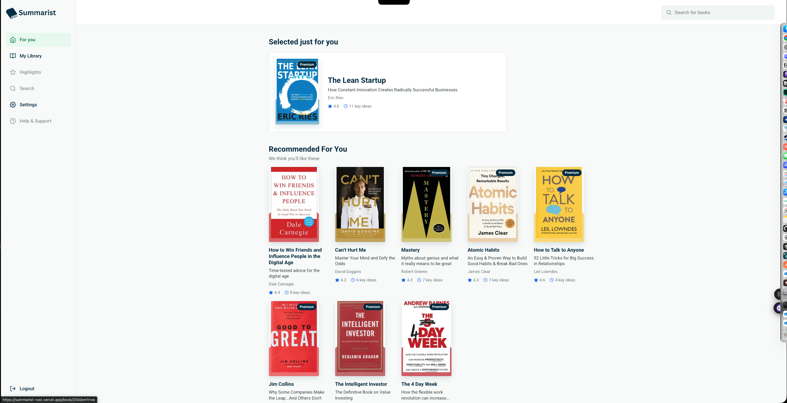
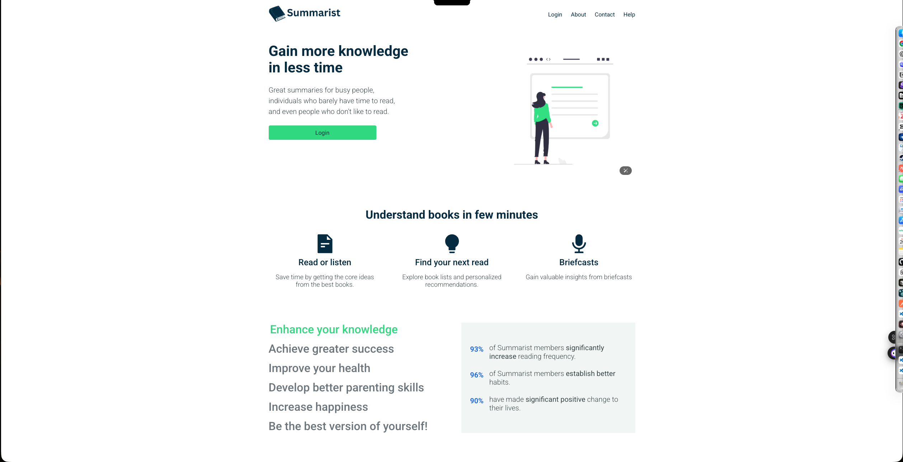
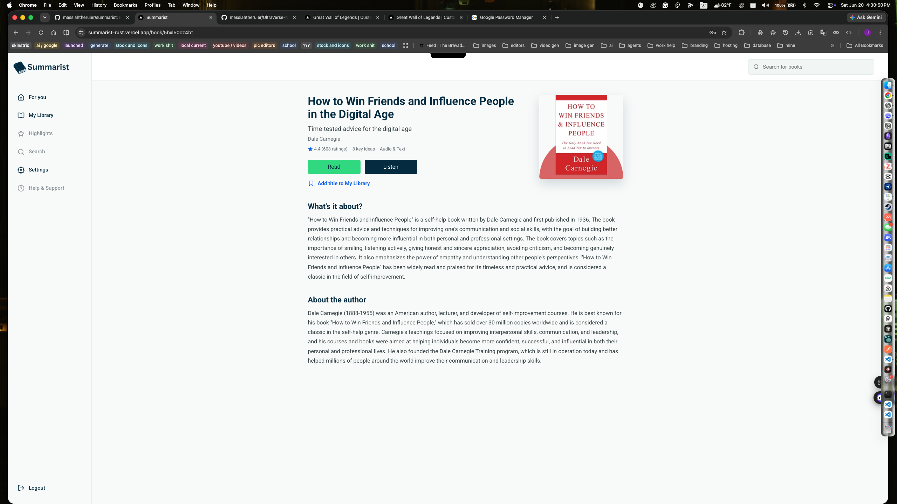
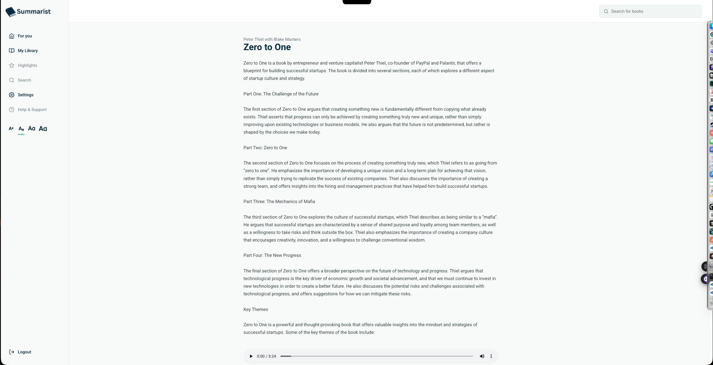
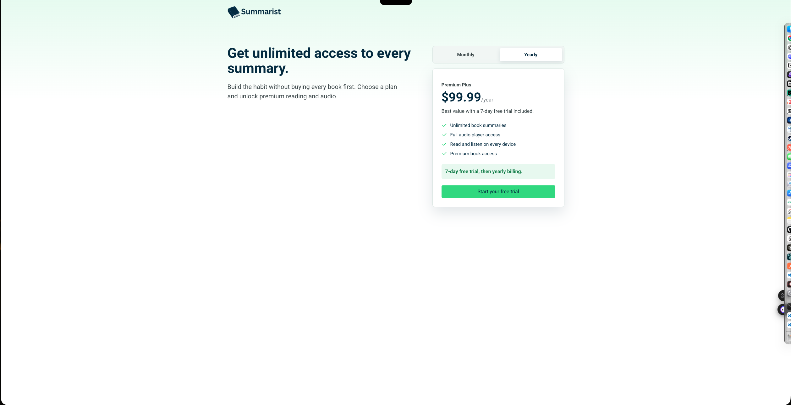
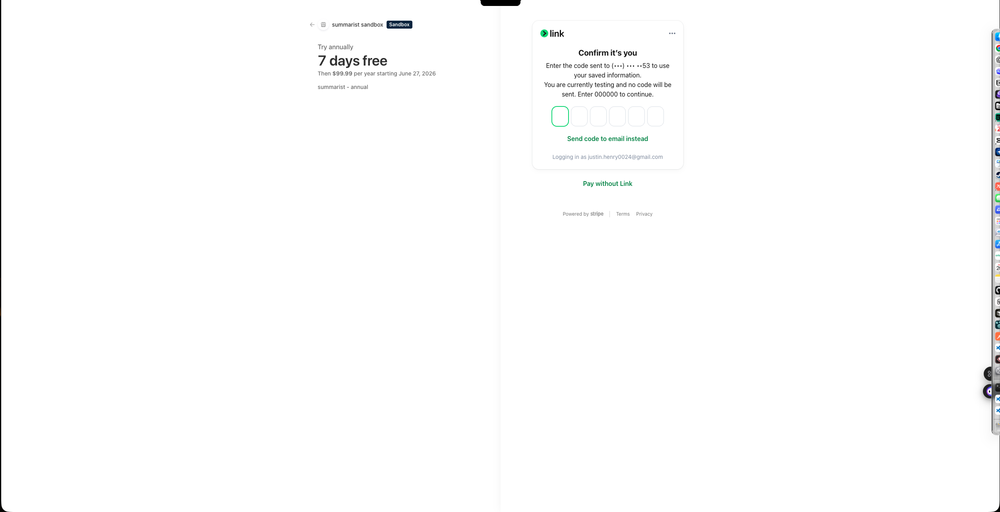

Summarist

Summarist is a subscription-based book summary and audiobook platform built as part of the Frontend Simplified Virtual Internship.

The original assignment was to recreate the core experience of a production web application, including authentication, book discovery, premium content access, audio playback, subscriptions, search, and user account management. While starter assets and homepage styling were provided, the application logic, routing, state management, authentication flows, persistence layer, premium gating, and payment integration were implemented from scratch.

Rather than treating the project as a UI recreation, I approached it like a real product. User actions persist across sessions, premium content is protected, subscriptions affect application behavior, and account state drives the user experience throughout the platform.

Live Demo

https://summarist-rust.vercel.app

Demo Accounts

Standard User
Email: guest123@gmail.com
Password: guest123

Premium User
Email: guest@gmail.com
Password: guest123

Project Preview

These screenshots show the full subscription product flow: the landing page, authentication, book summary experience, audio player, Stripe checkout entry, and payment verification step.

⸻

Key Features

Authentication

- Firebase email/password authentication
- Google authentication
- Guest login
- Forgot password flow
- Custom authentication modal
- Protected routes and user-specific experiences

Content Discovery

- Real book data from the Summarist API
- Personalized “For You” recommendations
- Dynamic book detail pages
- Debounced search functionality
- Responsive browsing experience

Reading & Listening Experience

- Dynamic audiobook player pages
- Premium content gating
- Reader text-size controls
- Saved books library
- Finished books tracking
- Persistent user preferences

Payments & Subscriptions

- Stripe Checkout integration
- Monthly and yearly subscription plans
- Premium feature access control
- Subscription-aware application state

UX & Product Enhancements

Features added beyond the internship requirements:

- Firestore persistence layer
- Google authentication
- Finished books tracking
- Reader customization controls
- Rotating homepage content
- Additional premium-access safeguards
- Improved settings experience
- Expanded saved-book workflows

⸻

Tech Stack

Frontend

- Next.js 16 App Router
- React 19
- TypeScript
- CSS
- React Icons

Authentication & Data

- Firebase Authentication
- Firestore

Payments

- Stripe Checkout
- Stripe Subscriptions

Deployment

- Vercel

⸻

Architecture Highlights

- Authentication state drives application-wide behavior
- Firestore persistence scoped by authenticated user
- Subscription-aware UI and protected premium content
- Dynamic routing with Next.js App Router
- Shared React Context providers for authentication, subscription state, and reader preferences
- Persistent saved books and finished books collections

Firestore structure:

users/{uid}/library/{bookId}

users/{uid}/finished/{bookId}

⸻

Engineering Challenges

The most interesting part of the project was not building pages. It was coordinating multiple systems that all depended on each other.

A user could authenticate, subscribe, save books, access premium content, finish audiobooks, sign out, and return later expecting everything to remain consistent. That required authentication state, Firestore persistence, Stripe subscription status, routing logic, and UI state to stay synchronized across the application.

Some of the key problems I solved included:

- Ensuring premium actions behaved differently based on authentication and subscription state
- Preventing checkout flows from creating subscriptions without an associated user account
- Persisting saved books and finished books across sessions
- Rehydrating user-specific data when returning to the platform
- Maintaining consistent application behavior across logged-in, logged-out, free, and premium experiences
- Balancing assignment requirements with practical product decisions

One example was the audiobook player. The reference implementation used a custom player design, but I chose to leverage the browser’s native audio controls because they provide accessibility, playback speed controls, seeking, downloads, and platform-level optimizations without rebuilding existing functionality.

⸻

Future Improvements

If expanded into a production application, the next priorities would be:

- Stripe webhooks
- Server-verified subscription status
- Subscription records stored in Firestore
- Customer billing portal integration
- Reading progress synchronization
- Improved API resilience and error handling
- Analytics and recommendation tracking

⸻

Author

Justin H.

GitHub: github.com/massiahtheruler

LinkedIn: linkedin.com/in/justin-henry
